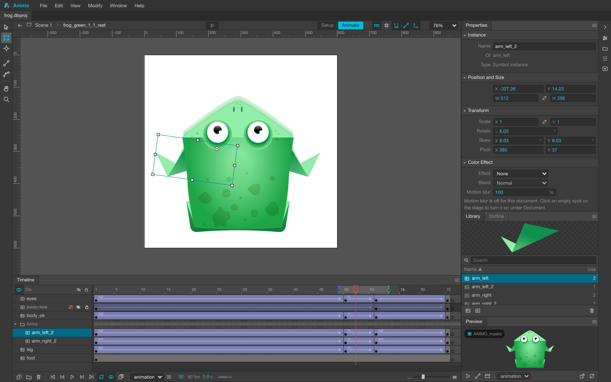
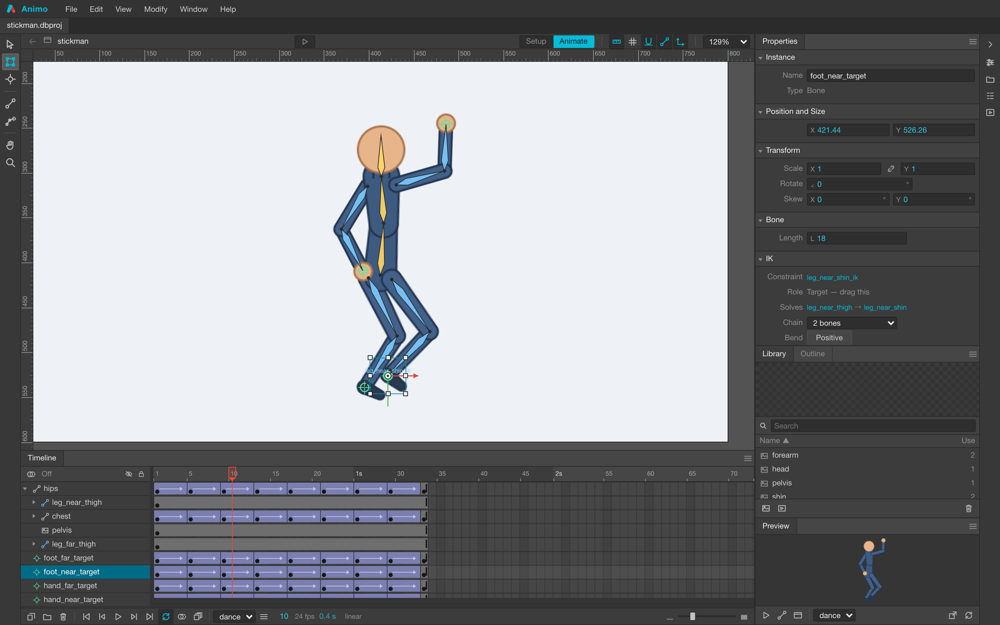
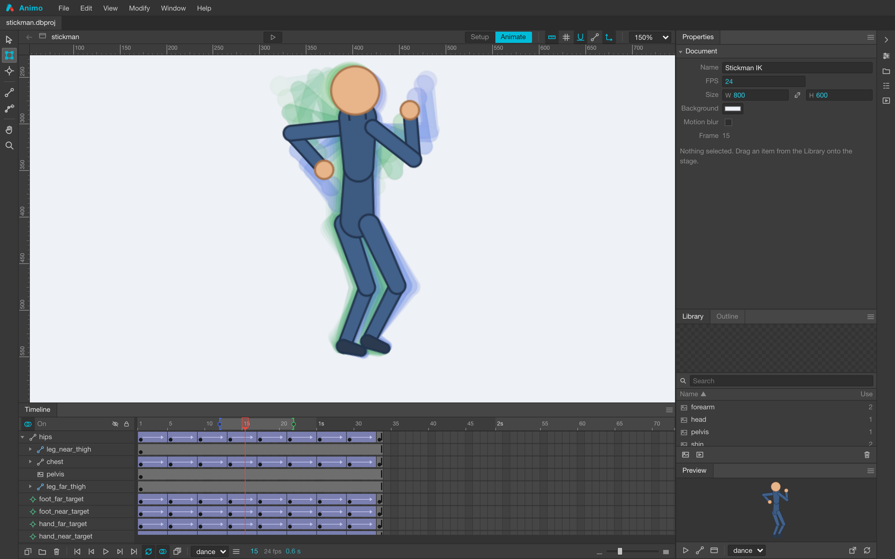
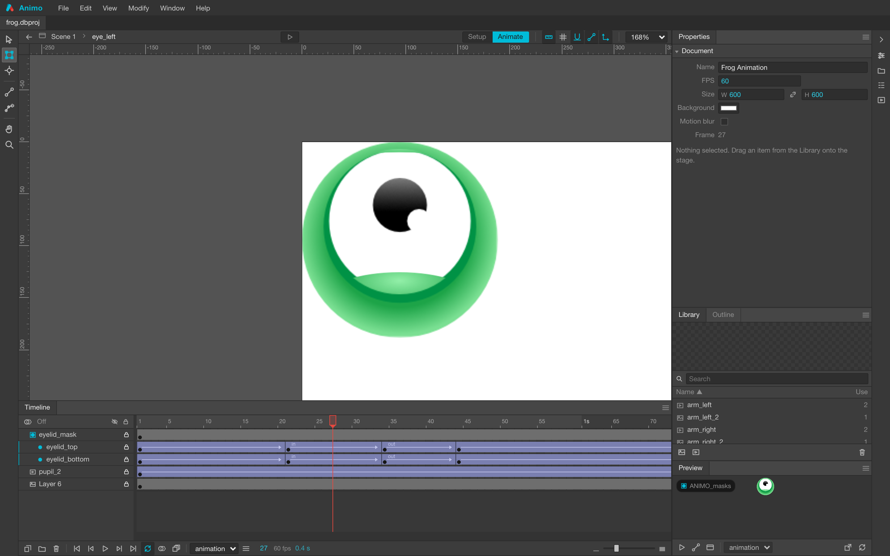
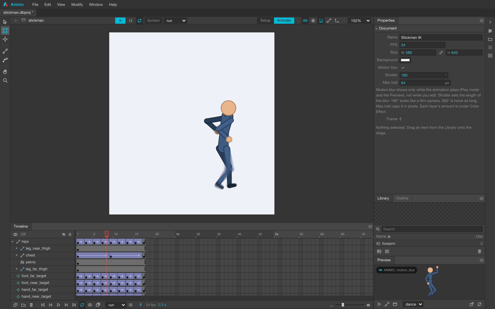
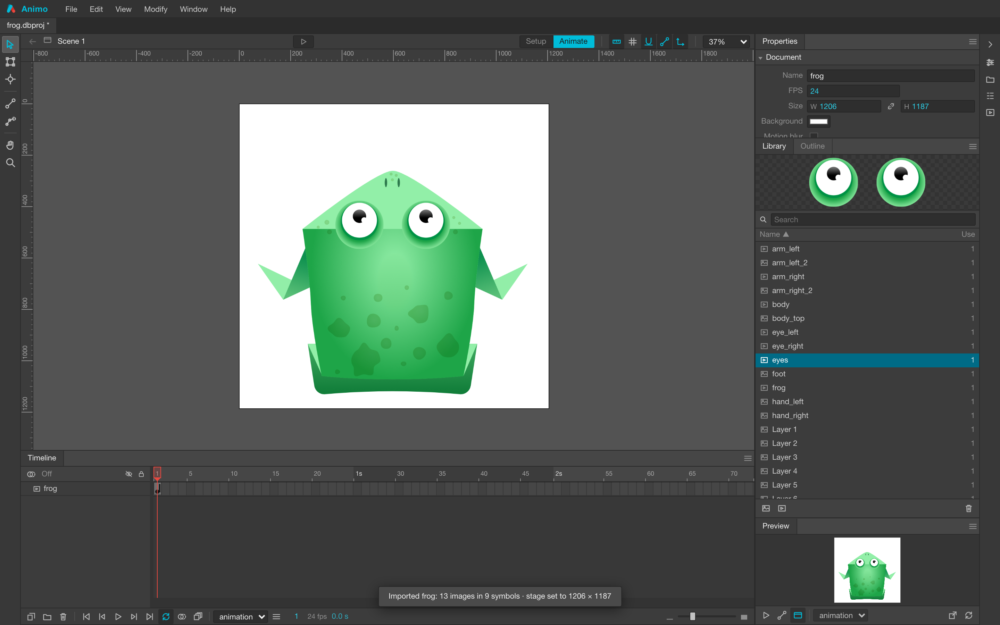
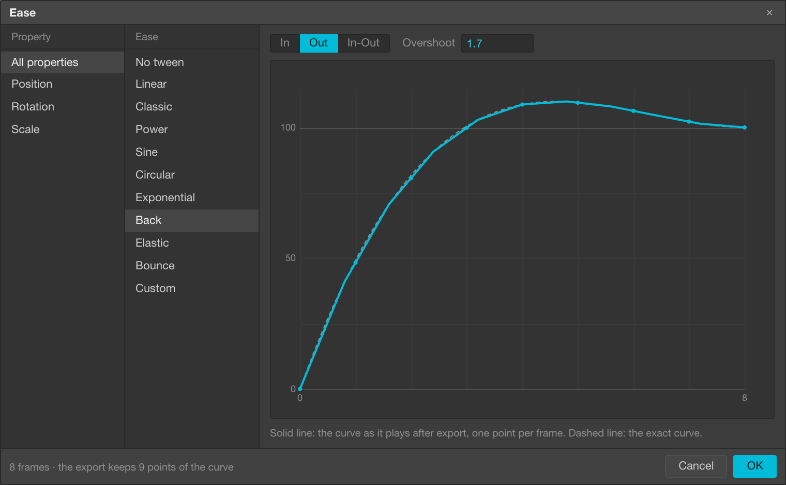
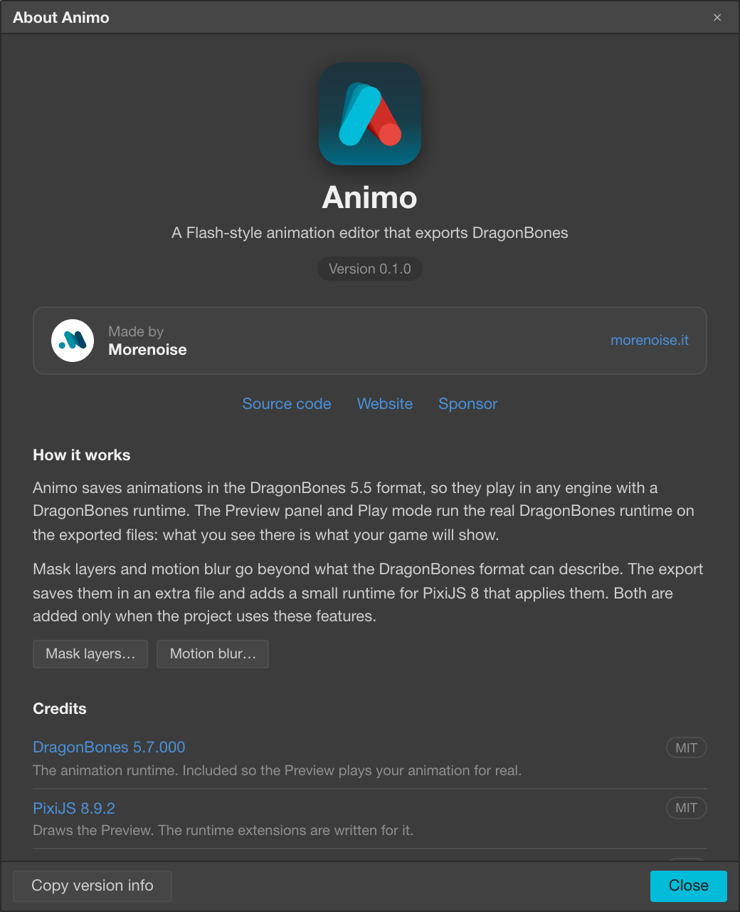

<div align="center">

# Animo

**A Flash-style animation editor that exports DragonBones.**

[](LICENSE)
[](https://github.com/justmorenoise/animo/actions/workflows/ci.yml)
[](tests)

[Website](https://morenoise.it/en/apps/animo) · [Architecture](docs/ARCHITECTURE.md) · [Contributing](CONTRIBUTING.md)



</div>

## What it is

I used Flash for fifteen years. Now that I am making my own 2D games I wanted an
animation program with the same approach: a timeline, layers, keyframes, symbols you
can open and animate inside.

But I wanted the result to be compatible with DragonBones skeletal animation, so I
could use it in PixiJS today and in other frameworks later. That is where Animo comes
from. It keeps full compatibility with the DragonBones format and, at the same time,
most of what made Flash worth using, with the same feel.

The two models line up better than they have any right to. DragonBones composes a
transform exactly as Flash does:

```
a =  cos(skY)·scX      c = -sin(skX)·scY      tx = x
b =  sin(skY)·scX      d =  cos(skX)·scY      ty = y
```

A pure rotation is `skX == skY`; shear is the difference between them. Scale, skew and
rotation map one-to-one, so nothing is approximated between what you draw and what the
runtime plays.

It runs in the browser. No install, no account, no upload: your project is a file on
your disk.

## The preview is ground truth

The **Preview** panel and Play mode are not a second renderer. They export the project
in memory and hand the **actual** DragonBones runtime the exact bytes that would go to
disk. If the stage and the preview disagree, the export is wrong, and you find that out
while authoring, not after shipping.

Editor and runtime world matrices currently agree to 0 at keyframes and to ~3e-6
mid-tween, which is the exporter's own rounding.

## What it does

| | |
|---|---|
| **Timeline** | Flash frame algebra: F5/F6/F7, keyframe drag, frame ranges, three clipboards, Paste and Overwrite, per-property easing with a curve editor |
| **Symbols** | Symbol = armature. Convert to Symbol, edit in place with the scene dimmed behind, nested symbols drawn at the playhead |
| **Bones and IK** | Two-bone and look-at chains, solved with a transcription of the runtime's own solver, so the stage shows what the runtime will do |
| **Layers** | Groups, z-order as one depth-first list, several displays per layer, exclude-from-export for reference art |
| **Masks** | A mask layer clipping the layers linked to it, nested symbols included |
| **Onion skin** | Ghosts between two markers on the ruler, past/future tinted, plus **Edit Multiple Frames**, which moves every keyframe in the range as one object |
| **Motion blur** | Per-sprite, from real pixel motion, driven by a shutter angle |
| **PSD import** | Groups become symbols, layers become images, raster masks applied, positions preserved |
| **Export** | DragonBones 5.5 skeleton, MaxRects atlas with alpha trimming, as a zip or straight to a folder |
| **The rest** | Undoable everything, rebindable keymap, dockable and floatable panels, rulers, guides, snapping, preferences |

<table>
<tr>
<td width="50%"></td>
<td width="50%"></td>
</tr>
<tr>
<td><b>Bones and IK.</b> Chains are solved at display time; the target is keyed, never the bones it drives.</td>
<td><b>Onion skin.</b> The range is two markers on the ruler, and it doubles as the range Edit Multiple Frames acts on.</td>
</tr>
<tr>
<td></td>
<td></td>
</tr>
<tr>
<td><b>Mask layers.</b> DragonBones has no mask, so Animo ships one as a runtime extension (see below).</td>
<td><b>Motion blur</b>, from how fast each piece actually moves. Only the runtime draws it, so this is Play mode.</td>
</tr>
<tr>
<td></td>
<td></td>
</tr>
<tr>
<td><b>PSD import.</b> Groups become symbols, layers become images, in place, and the stage takes the PSD's size.</td>
<td><b>Easing</b> per property, from presets or a custom curve. The solid line is what the export plays, frame by frame.</td>
</tr>
<tr>
<td colspan="2" align="center"></td>
</tr>
<tr>
<td colspan="2" align="center"><b>Built on DragonBones and PixiJS</b>, and it says so.</td>
</tr>
</table>

## Quick start

```bash
npm install
npm run dev       # http://localhost:5180
```

Chrome or Edge. Saving to a real file needs the File System Access API (elsewhere it
falls back to a download and a file picker); the preview needs WebGL.

```bash
npm test          # vitest
npm run build     # tsc --noEmit && vite build
```

## From a PSD to a game, end to end

1. **File ▸ Import PSD.** Groups become symbols, layers become images, positions are kept.
2. **Rig it.** Draw bones with `M`, bind artwork to them, add IK targets with `K`.
3. **Animate.** Keyframes with `F6`, tweens in between, easing per property.
4. **Watch the Preview panel** while you work: that is the runtime, not a mock-up.
5. **File ▸ Export DragonBones…** for a zip, or Export to Folder.

The export contains `<name>_ske.json`, the atlas pages and, when the project uses a
feature the format cannot carry, `<name>_ext.json` plus `animo-pixi.js`. In your game:

```js
import { installExtensions } from "./animo-pixi.js";

const factory = dragonBones.PixiFactory.factory;
factory.parseDragonBonesData(skeletonJson);          // <name>_ske.json
factory.parseTextureAtlasData(atlasJson, atlasTexture);

const display = factory.buildArmatureDisplay("<armature>");
app.stage.addChild(display);

// extJson is <name>_ext.json, loaded as plain JSON.
const extensions = installExtensions(display, extJson, { PIXI, ticker: PIXI.Ticker.shared });
display.animation.play();

// When the armature is removed:
extensions.destroy();
```

A project that uses neither masks nor motion blur exports plain DragonBones 5.5 and
needs none of this.

## How it relates to DragonBones and PixiJS

**DragonBones** is the format and the runtime. Animo writes DragonBones 5.5 data read out
of the runtime's own parser rather than out of documentation. Every part of that contract
fails *silently* when you guess it wrong, so the source is the authority
([the list is in the architecture doc](docs/ARCHITECTURE.md#the-dragonbones-55-contract)).
The runtime is vendored in `public/vendor/` so the preview can run the real thing.

**PixiJS 8** is the reference host. DragonBones 5.5 has no mask and no motion blur, not in
the format, not in the parser, not in `PixiSlot`, so both ship *beside* the skeleton as
runtime extensions, in a manifest modelled on glTF's. Each one is written into the export
only when the project actually uses it:

- **`ANIMO_masks`** lets you show one part of the artwork and hide another, softly if you
  want: the clip follows the alpha channel, so a semi-transparent mask leaves what is
  under it semi-transparent. An export that carries masks marks it *required*, because a
  player that skips it draws artwork meant to be hidden.
- **`ANIMO_motion_blur`** makes fast movement read as more cinematic, dialled in per
  element. It is *optional*: a player that skips it plays the animation without the
  softening.

One file, `src/runtime/animo-pixi.js`, implements both. The editor's own preview imports it
and the export ships it byte for byte, so the preview cannot drift from what a game sees.
The manifest stores *intent* (a shutter angle, not a Pixi filter setup), so another runtime
can implement the same extension names, and a future video export can honour the same
numbers exactly.

A stock DragonBones player (the official one, Cocos, Unity) ignores the extensions. The
export diagnostics say so out loud rather than letting you find out later.

## Architecture

The one rule everything else rests on: **`core/` imports nothing from `view/`, `app/` or
`io/`, and touches no DOM.** That is what lets the risky logic (transform maths, frame
algebra, the export contract, the atlas packer) run under vitest in Node.

```
src/
  core/      pure logic: math · document model and frame algebra · history · atlas · export · keys
  app/       Store, AssetStore, TimelineOps, clipboards, ProjectService, Keymap
  view/      shell, dockable panels, canvas viewport, tools, timeline
  io/        atlas rendering, zip bundling, file access, PSD reading
  preview/   the runtime iframe host and its client
  runtime/   animo-pixi.js, the extension module that ships inside the export
```

[**docs/ARCHITECTURE.md**](docs/ARCHITECTURE.md) is the real documentation: 1500 lines on
how this is put together and, mostly, on the things that fail silently when you get them
wrong. Read the section covering what you are about to touch.

## Not built yet

Stated plainly, because a feature list that quietly omits these is worse than useless:

- **Hand (H) and Zoom (Z) are toolbar buttons with no tool behind them.** They fall back to
  the Selection tool. Both capabilities exist by another route: pan is space-drag or the
  middle button, zoom is the wheel and ⌘±.
- **No vector drawing tools and no mesh deformation.** Vector shapes have no home in the
  DragonBones format; the only route would be to rasterise at export, which fixes resolution
  at bake time and rules out shape tweening.
- **Flash's per-keyframe Swap Instance** is not built. Swap Instance swaps the display
  showing at the playhead, on every key that shows it.
- **Tint offsets do not survive.** `PixiSlot` applies only the colour multipliers, so Flash's
  additive Tint is not reproducible. The exporter warns if a document carries offsets.

## Animo Desktop

A desktop edition is in the works, and it pays for the work on this one: video and
spritesheet export, extra export formats, and an MCP server so an agent can drive the
editor. It will be at [morenoise.it](https://morenoise.it/en/apps/animo). Everything you see
in this repository stays free and open source.

You can also [sponsor the project](https://github.com/sponsors/justmorenoise).

## License

**AGPL-3.0-or-later**. See [LICENSE](LICENSE).

**What you export is yours.** The skeleton, the atlas, the extension manifest and
`animo-pixi.js` shipped beside them are MIT-licensed and put no obligation on the game you
put them in. That carve-out is explicit: [LICENSE-EXCEPTION.md](LICENSE-EXCEPTION.md).

Commercial licences for the editor are available: <info@morenoise.it>.

## Contributing

Issues and pull requests are welcome. Please read [CONTRIBUTING.md](CONTRIBUTING.md) first;
it is short, and it points at the three rules in this codebase that are easy to break by
accident. Contributors sign a [CLA](CLA.md), which is what keeps the dual licence above
possible.

## Credits

Built on [DragonBones](https://github.com/DragonBones/DragonBonesJS) and
[PixiJS](https://pixijs.com), both MIT, plus
[ag-psd](https://github.com/Agamnentzar/ag-psd) and
[fflate](https://github.com/101arrowz/fflate). Full notices in
[THIRD-PARTY-NOTICES.md](THIRD-PARTY-NOTICES.md).

By [Morenoise](https://morenoise.it).

DragonBones is a trademark of Egret Technology. PixiJS, Photoshop and Adobe Animate are
trademarks of their respective owners. Animo is an independent project, not affiliated with
or endorsed by any of them.
